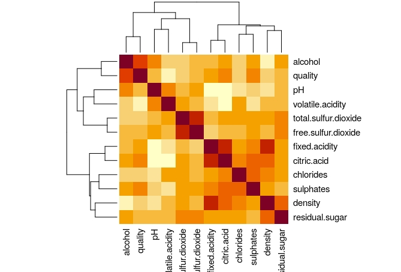
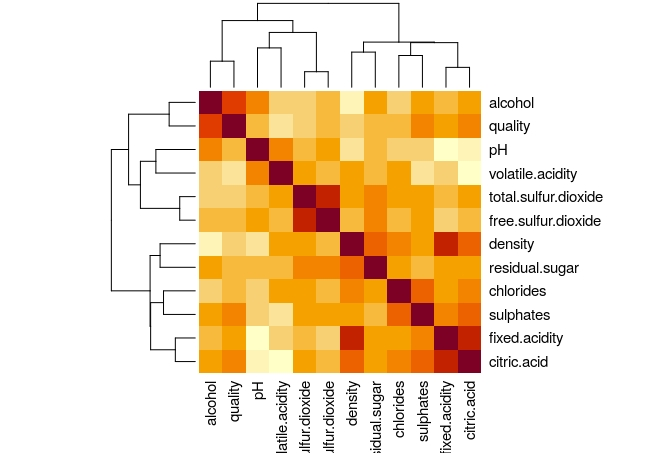

```{r setup, include=FALSE}
knitr::opts_chunk$set(echo = TRUE)
setwd(getwd())
```

# **Introduction**
## Project goal:
  The purpose of this project is to create an accurate wine quality classifier. 

## Datasets general information:
  There are two data sets: Red and White Wines. They are related to variants of the Portuguese "Vinho Verde" wine. Also, both have eleven physicochemical and one sensory variables:    
  1  - Fixed acidity;  
  2  - Volatile acidity;  
  3  - Citric acid;  
  4  - Residual sugar;  
  5  - Chlorides;  
  6  - Free sulfur dioxide;  
  7  - Total sulfur dioxide;  
  8  - Density;  
  9  - pH;  
  10 - Sulphates;  
  11 - Alcohol;  
  12 - Quality.
  
  There are more characteristics and hints available in the winequality.names file:  
   - The classes are ordered and not balanced (e.g. there are munch more normal wines than excellent or poor ones);    
   - Outlier detection algorithms could be used to detect the few excellent or poor wines;  
   - Several of the attributes may be correlated, thus it makes sense to apply some sort of feature selection;  
  
## Project planning:
  To achieve good performance in the analysis, this project will follow these steps:

  **Methods and Analysis** - Investigate the data set to understand more about it.  
	**Data Cleaning** - Clean and prepare the data set for modelling.  
	**Data Modeling** - Training and testing a section of the data sets to elect a preferred method.  
	**Method Validation** - Final testing and results report.  
\newpage

# **Methods and Analysis**  
## Data Loading
  The next code is supposed to load the required packages:
```{r, eval=TRUE, message=FALSE, warning=FALSE}
repo <- "http://cran.us.r-project.org"

# Required packages:
if(!require(tidyverse))     install.packages("tidyverse",    repos = repo)
if(!require(caret))         install.packages("caret",        repos = repo)
if(!require(data.table))    install.packages("data.table",   repos = repo)
if(!require(purrr))         install.packages("purrr",        repos = repo)
if(!require(randomForest))  install.packages("randomForest", repos = repo)
if(!require(h2o))           install.packages("h2o",          repos = repo)
if(!require(Boruta))        install.packages("Boruta",       repos = repo)

library(tidyverse)
library(caret)
library(data.table)
library(purrr)
library(randomForest)
library(h2o)
library(Boruta)

```
```{r, eval=TRUE, message=FALSE, warning=FALSE, echo=FALSE}
h2o.no_progress()  # Disable progress bars for Rmd
```
   The next code will download the red and white wine data sets:
```{r, eval=TRUE, message=FALSE, warning=FALSE}
  url  <- "https://archive.ics.uci.edu/ml/machine-learning-databases/wine-quality"
  
  dl <- tempfile()
  # Download red_wine data set
  download.file(paste(url,"/winequality-red.csv",sep = ""), dl)
  red_wine <- read.csv(dl, sep =  ";")
  
  # Download white_wine data set  
  download.file(paste(url,"/winequality-white.csv",sep = ""), dl)
  white_wine <- read.csv(dl, sep =  ";")
```
  
  After download, we must create the validation set with 10% of the whole data sets.
```{r, eval=TRUE, message=FALSE, warning=FALSE}
  # Create red_wine general and validation set
  set.seed(2021, sample.kind = "Rounding")
  
  red_test_index <- createDataPartition(red_wine$quality, p = 0.1, list = FALSE)
  
  red_general <- red_wine[-red_test_index,]
  red_validation <- red_wine[red_test_index,]
  
  # Create white_wine general and validation set
  set.seed(2021, sample.kind = "Rounding")
  
  white_test_index <- createDataPartition(white_wine$quality, p = 0.1, list = FALSE)
  
  white_general <- red_wine[-white_test_index,]
  white_validation <- red_wine[white_test_index,]
```

## Correlation analysis
   Given that the author of this data set mentions the possible correlation between variables, it becomes necessary to examine it. What the code below does is to calculate the Pearson correlation, i.e. the linear correlation between variables and produce a matrix with all of them. We are selecting all correlations with a coefficient higher than 0.6 and lower than -0.6, an arbitrary number.
```{r, eval=TRUE, message=FALSE, warning=FALSE}
### CORRELATION TEST
cor_limit <- 0.6

## red wine correlation
red_cor <- round(cor(red_general),2)

red_cor_lim_ind <- lapply(apply(red_cor < -cor_limit | red_cor > cor_limit & red_cor < 1,
                            1, which), names)

red_cor_lim_ind <- red_cor_lim_ind[lengths(red_cor_lim_ind) > 0]

red_cor_list <- lapply(c("fixed.acidity","free.sulfur.dioxide"), function(x){
  select(all_of(x),.data = as.data.frame(red_cor[names(red_cor_lim_ind),
                                                 names(red_cor_lim_ind)])) %>% 
  filter_all(all_vars(. < -cor_limit | . > cor_limit & . < 1))
})
## white wine correlation
white_cor <- round(cor(white_general),2)

w_cor_lim_ind <- lapply(apply(white_cor < -cor_limit | white_cor > cor_limit & white_cor < 1,
                            1, which), names)

w_cor_lim_ind <- w_cor_lim_ind[lengths(w_cor_lim_ind) > 0]

white_cor_list <- lapply(c("fixed.acidity","free.sulfur.dioxide"), function(x){
  select(all_of(x),.data = as.data.frame(white_cor[names(w_cor_lim_ind),
                                                 names(w_cor_lim_ind)])) %>% 
    filter_all(all_vars(. < -cor_limit | . > cor_limit & . < 1))
})
```   
```{r, eval=FALSE, message=FALSE, warning=FALSE}
# Red Wine correlation heatmap
heatmap(red_cor, symm = TRUE) # Heatmap on the left
# White Wine correlation heatmap
heatmap(white_cor, symm = TRUE) # Heatmap on the right
```
{width=50% height=50%}{width=50% height=50%}
  The correlations with values on our desired range can be seen below:
```{r, eval=TRUE, message=TRUE, warning=FALSE}
# Red wine correlation list
red_cor_list
# White wine correlation list
white_cor_list
```

## Importance Analysis
  We can infer that the correlation is not sufficient for any intervention. In this case, we can examine the Variable Importance Measure (VIM) through random forests with the Boruta package. The description of this method, in the *RDocumentation* package page, is that the method *performs a top-down search for relevant features by comparing original attributes' importance with importance achievable at random, estimated using their permuted copies, and progressively eliminating irrelevant features to stabilise that test*.  
```{r, eval=TRUE, message=FALSE, warning=FALSE}
## Red Wine Boruta attribute importance
set.seed(2021, sample.kind = "Rounding")
rg_boruta <- Boruta(as.factor(quality) ~ ., data = red_general, doTrace = 2, maxRuns = 500)
## White Wine Boruta attribute importance
set.seed(2021, sample.kind = "Rounding")
wg_boruta <- Boruta(as.factor(quality) ~ ., data = white_general, doTrace = 2, maxRuns = 500)
```
  
  **Red Wine attribute importance:**
```{r, eval=TRUE, message=TRUE, warning=FALSE, echo=FALSE}
rg_boruta
```
  
  **White Wine attribute importance:**
```{r, eval=TRUE, message=TRUE, warning=FALSE, echo=FALSE}
wg_boruta
```

  Because of this analysis, we can determine that all variables in both data sets are important, therefore must be kept when training future machine learning models. 
  
# **Data Cleaning**  
  Considering the authors sign of possible outliers in the data set, we must find a way of detecting and removing them. To that, we use a method to isolate variables through random *decision trees* and assume the farthest ones as anomalies. This technique is called *Isolation Forests*.
  The code below calculates and stores a set of possible anomalies based on an arbitrary threshold.
```{r, eval=TRUE, message=FALSE, warning=FALSE, include=FALSE}
# Isolation forest with h2o
threshold <- .98
#Initializing h2o on the localhost
localH2O <- h2o.init(ip="localhost", port = 54321, 
                     startH2O = TRUE, nthreads=-1)
# RED WINE!
# Making the quality column, a factor
red_general[,12] <- as.factor(red_general[,12])
h2o_rg <- as.h2o(red_general) # making a data set readable to h2o models

rg_isoforest <- h2o.isolationForest(training_frame = h2o_rg,
                                    sample_rate = 0.1,
                                    max_depth = 50, # max depth of trees
                                    ntrees = 100, # number of trees
                                    seed = 2021)

# Predicting based on the isolation forest
rg_score <- h2o.predict(rg_isoforest, h2o_rg)

# Score limit based on the threshold and the predict score
rg_scoreLimit <- round(quantile(as.vector(rg_score$predict), threshold), 4)

# Bind the "level of abnormality" of each row to the general data set
red_general <- cbind(RowScore = round(as.vector(rg_score$predict), 4), red_general)

# Select the rows higher than the threshold
rg_anomalies <- red_general[red_general$RowScore > rg_scoreLimit,]

# Delete the bind rows
red_general <- red_general[,2:13]
rg_anomalies <- rg_anomalies[,2:13]

# WHITE WINE!
# Making the quality column, a factor
white_general[,12] <- as.factor(white_general[,12])
h2o_w <- as.h2o(white_general) # making a data set readable to h2o models

w_isoforest <- h2o.isolationForest(training_frame = h2o_w,
                                   sample_rate = 0.1,
                                   max_depth = 50, # max depth of trees
                                   ntrees = 100, # number of trees
                                   seed = 2021)

# Predicting based on the isolation forest
w_score <- h2o.predict(w_isoforest, h2o_w)

# Score limit based on the threshold and the predict score
w_scoreLimit <- round(quantile(as.vector(w_score$predict), threshold), 4)

# Bind the "level of abnormality" of each row to the general data set
white_general <- cbind(RowScore = round(as.vector(w_score$predict), 4), white_general)

# Select the rows higher than the threshold
wg_anomalies <- white_general[white_general$RowScore > w_scoreLimit,]

# Delete the bind rows
white_general <- white_general[,2:13]
wg_anomalies <- wg_anomalies[,2:13]
```
```{r, eval=FALSE, message=FALSE, warning=FALSE}
# Isolation forest with h2o
threshold <- .98
#Initializing h2o on the localhost
localH2O <- h2o.init(ip="localhost", port = 54321, 
                     startH2O = TRUE, nthreads=-1)

# RED WINE!
# Making the quality column, a factor
red_general[,12] <- as.factor(red_general[,12])
h2o_rg <- as.h2o(red_general) # making a data set readable to h2o models

rg_isoforest <- h2o.isolationForest(training_frame = h2o_rg,
                                    sample_rate = 0.1,
                                    max_depth = 50, # max depth of trees
                                    ntrees = 100, # number of trees
                                    seed = 2021)

# Predicting based on the isolation forest
rg_score <- h2o.predict(rg_isoforest, h2o_rg)

# Score limit based on the threshold and the predict score
rg_scoreLimit <- round(quantile(as.vector(rg_score$predict), threshold), 4)

# Bind the "level of abnormality" of each row to the general data set
red_general <- cbind(RowScore = round(as.vector(rg_score$predict), 4), red_general)

# Select the rows higher than the threshold
rg_anomalies <- red_general[red_general$RowScore > rg_scoreLimit,]

# Delete the bind rows
red_general <- red_general[,2:13]
rg_anomalies <- rg_anomalies[,2:13]

# WHITE WINE!
# Making the quality column, a factor
white_general[,12] <- as.factor(white_general[,12])
h2o_w <- as.h2o(white_general) # making a data set readable to h2o models

w_isoforest <- h2o.isolationForest(training_frame = h2o_w,
                                   sample_rate = 0.1,
                                   max_depth = 50, # max depth of trees
                                   ntrees = 100, # number of trees
                                   seed = 2021)

# Predicting based on the isolation forest
w_score <- h2o.predict(w_isoforest, h2o_w)

# Score limit based on the threshold and the predict score
w_scoreLimit <- round(quantile(as.vector(w_score$predict), threshold), 4)

# Bind the "level of abnormality" of each row to the general data set
white_general <- cbind(RowScore = round(as.vector(w_score$predict), 4), white_general)

# Select the rows higher than the threshold
wg_anomalies <- white_general[white_general$RowScore > w_scoreLimit,]

# Delete the bind rows
white_general <- white_general[,2:13]
wg_anomalies <- wg_anomalies[,2:13]
```
  
# **Data Modeling**  
  With all data explored and cleaned, we must try different machine learning techniques to select a preferred method for our final validation.
  Before the training, it is necessary to slice the "red_general" and "white_general" data sets to ensure no bias in the final validation. The test size will be 20% of the training to make sure the methods will have plenty of data to examine.
```{r, eval=TRUE, message=FALSE, warning=FALSE}
### RED WINE!!
set.seed(2021, sample.kind = "Rounding")
rex_index <- createDataPartition(red_general$quality, p = .2, list = FALSE)

# Sectioning
rex_train <- red_general[-rex_index,]
rex_test <- red_general[rex_index,]

# Anomaly removal
rex_train <- anti_join(rex_train, rg_anomalies)

# H2o translation
h2o_rex_train <- as.h2o(rex_train)
h2o_rex_test  <- as.h2o(rex_test)

### WHITE WINE!!
set.seed(2021, sample.kind = "Rounding")
wex_index <- createDataPartition(white_general$quality, p = .2, list = FALSE)

# Sectioning
wex_train <- white_general[-wex_index,]
wex_test <- white_general[wex_index,]

# Anomaly removal
wex_train <- anti_join(wex_train, wg_anomalies)

# H2o translation
h2o_wex_train <- as.h2o(wex_train)
h2o_wex_test  <- as.h2o(wex_test)
```

## Random Forest  
  The first method is the random forest, reliable for classification tasks. In the code below, we train the algorithm for a range tree sizes, then selecting what gives the best accuracy.
```{r, eval=TRUE, message=FALSE, warning=FALSE}
l <- seq(1,500,5)

## Red Wine - Random Forest
rex_rf_acc_test <- sapply(l, function(x){
  set.seed(2021, sample.kind = "Rounding")
  
  fit <- randomForest(quality ~ .,
                      data = rex_train,
                      importance = TRUE, # Access importance in the method
                      proximity = TRUE, # Proximity will be calculated
                      ntree=x) # Number of trees
  confusionMatrix(predict(fit, rex_test),
                  as.factor(rex_test$quality))$overall["Accuracy"]
  
})
# Select the best ntree and accuracy
rex_sel_l <- l[which.max(rex_rf_acc_test)]
rex_rf_acc <- max(rex_rf_acc_test)

## White Wine - Random Forest
wex_rf_acc_test <- sapply(l, function(x){
  set.seed(2021, sample.kind = "Rounding")
  
  fit <- randomForest(quality ~ .,
                      data = wex_train,
                      importance = TRUE, # Access importance in the method
                      proximity = TRUE, # Proximity will be calculated
                      ntree=x) # Number of trees
  confusionMatrix(predict(fit, wex_test),
                  as.factor(wex_test$quality))$overall["Accuracy"]
  
})
# Select the best ntree and accuracy
wex_sel_l <- l[which.max(wex_rf_acc_test)]
wex_rf_acc <- max(wex_rf_acc_test)
```
  
## Deep Learning  
  The deep learnning method used in this section, as described by the h2o documentation website, is *a multi-layer feedforward artificial neural network that is trained with stochastic gradient descent using back-propagation*. In other words, it is a simple artificial network that only moves forward on its iterations between layers (multi-layer feedforward) and trained with a gradient to fasten computations (stochastic gradient descent using back-propagation).
```{r, eval=TRUE, message=FALSE, warning=FALSE}
## Red Wine - DeepLearning
rex_dl <- h2o.deeplearning(x = names(h2o_rex_train[,1:11]), # predictors
                           y = names(h2o_rex_train[,12]), # to be predicted
                           training_frame = h2o_rex_train,
                           model_id = "rex_tdl",
                           activation = "Tanh",
                           epochs = 200,
                           balance_classes = TRUE,
                           max_after_balance_size = 6, # inflate the sample size
                                                       # up to 6 times
                           hidden = c(200,200,100), # arbitrary number of layers
                           seed = 2021)

# Accuracy based on the confusion matrix in the test set
rex_dl_acc <- 1- h2o.performance(rex_dl,h2o_rex_test)@metrics$cm$table[["Error"]][7]

## White Wine - DeepLearning
wex_dl <- h2o.deeplearning(x = names(h2o_wex_train[,1:11]), # predictors
                           y = names(h2o_wex_train[,12]), # to be predicted
                           training_frame = h2o_wex_train,
                           model_id = "wex_tdl",
                           activation = "Tanh",
                           epochs = 200,
                           balance_classes = TRUE,
                           max_after_balance_size = 6, # inflate the sample size
                                                       # up to 6 times
                           hidden = c(200,200,100), # arbitrary number of layers
                           seed = 2021)

# Accuracy based on the confusion matrix in the test set
wex_dl_acc <- 1 - h2o.performance(wex_dl,h2o_wex_test)@metrics$cm$table[["Error"]][7]
```
## Gradient Boosting Machine
 The gradient boosting machine is a forward learning ensemble technique. The philosophy of this method, as described by the h2o documentation website, is that good predictive results can be obtained through increasingly refined approximations. To achieve that, the GBM method uses regression trees on all features in parallel. The code below demonstrates its usage:

```{r, eval=TRUE, message=FALSE, warning=FALSE}
## Red Wine - GBM
rex_gbm <- h2o.gbm(x = names(h2o_rex_train[,1:11]),
                   y = names(h2o_rex_train[,12]),
                   training_frame = h2o_rex_train,
                   model_id = "rex_gbm",
                   ntrees = 700, # Number of trees
                   balance_classes = TRUE,
                   seed = 2021)

# Accuracy based on the confusion matrix in the test set
rex_gbm_acc <- 1 - h2o.performance(rex_gbm,h2o_rex_test)@metrics$cm$table[["Error"]][7]

## White Wine - GBM
wex_gbm <- h2o.gbm(x = names(h2o_wex_train[,1:11]),
                   y = names(h2o_wex_train[,12]),
                   training_frame = h2o_wex_train,
                   model_id = "wex_gbm",
                   ntrees = 700, # Number of trees
                   balance_classes = TRUE,
                   seed = 2021)

# Accuracy based on the confusion matrix in the test set
wex_gbm_acc <- 1 - h2o.performance(wex_gbm,h2o_wex_test)@metrics$cm$table[["Error"]][7]
```

## Accuracy Table
  After all those tests, we must select the method with better accuracy:
  
| Method        | Red Wine        | White Wine      |
|:--------------|:----------------|:----------------|
| Random Forest | `r rex_rf_acc`  | `r wex_rf_acc`  |
| Deep Learning | `r rex_dl_acc`  | `r wex_dl_acc`  |
| GBM           | `r rex_gbm_acc` | `r wex_gbm_acc` |
  
  Considering that the highest accuracy was on the Random Forest method, we will use it on the final validation set.

# **Method Validation**
  The steps will be repeated, except the selection of an optimal number of trees, to keep the code validity.
```{r, eval=TRUE, message=FALSE, warning=FALSE}
## Red Wine - Final Validation

# Remove anomalies
red_general <- anti_join(red_general, rg_anomalies)

# Random Forest
set.seed(2021, sample.kind = "Rounding")
red_fit <- randomForest(quality ~ .,
                    data = red_general,
                    importance = TRUE,
                    proximity = TRUE, 
                    ntree=rex_sel_l) # Using prior best ntree

red_val_acc <- confusionMatrix(predict(red_fit, red_validation),
                               as.factor(red_validation$quality))$overall["Accuracy"]

## White Wine - Final Validation

# Remove anomalies
white_general <- anti_join(white_general, rg_anomalies)

# Random Forest
set.seed(2021, sample.kind = "Rounding")
wed_fit <- randomForest(quality ~ .,
                        data = white_general,
                        importance = TRUE,
                        proximity = TRUE, 
                        ntree=wex_sel_l) # Using prior best ntree

wed_val_acc <- confusionMatrix(predict(wed_fit, white_validation),
                               as.factor(white_validation$quality))$overall["Accuracy"]
```
  
  The final accuracy table, with expected and observed values:  
  
| Random Forest | Red Wine        | White Wine      |
|:--------------|:----------------|:----------------|
|Expected:      | `r rex_rf_acc`  | `r wex_rf_acc`  |
|Observed:      | `r red_val_acc` | `r wed_val_acc` |
  
# **Conclusion**
## Results Discussion
  The observed results in both sets were better than the expected, which is great and uncommon. A possible answer is the larger size, even if just 10%. The goal of the project was accomplished, unfortunately the outcome wasn't fantastic, an accuracy of about 70% is good but far from excellent.
  
## Limitations and Future work
  Each method has their own particular limitations, being its complexity, processing demand, or slowness. The best practice for now on is to study more about neural networks and deep learning, comprehend better their concepts, apply them with more efficiency, and consequently maybe having a more accurate prediction.

# **References**
Barus, Martin. “Anomaly Detection with Isolation Forests Using h2o.” H2O.Ai, 8 Nov. 2019, www.h2o.ai/blog/anomaly-detection-with-isolation-forests-using-h2o/. 
  
Breiman, L (2002), ``Manual On Setting Up, Using, And Understanding Random Forests V3.1'', https://www.stat.berkeley.edu/~breiman/Using_random_forests_V3.1.pdf.
  
“Deep Learning (Neural Networks).” Deep Learning (Neural Networks) - H2O 3.32.1.4 Documentation, Feb. 2021, docs.h2o.ai/h2o/latest-stable/h2o-docs/data-science/deep-learning.html. 
  
“Gradient Boosting MACHINE (GBM).” Gradient Boosting Machine (GBM) - H2O 3.32.1.4 Documentation, Apr. 2021, docs.h2o.ai/h2o/latest-stable/h2o-docs/data-science/gbm.html. 
  
IBM Cloud Education. “What Is Random Forest?” IBM, Dec. 2020, www.ibm.com/cloud/learn/random-forest. 
Irizarry, Rafael  A. Introduction to Data Science. Leanpub, 2021. 
  
“Isolation Forest.” Isolation Forest - H2O 3.32.1.4 Documentation, Sept. 2020, docs.h2o.ai/h2o/latest-stable/h2o-docs/data-science/if.html. 
  
Miron B. Kursa, Witold R. Rudnicki (2010). Feature Selection with the Boruta Package. Journal of Statistical Software, 36(11), p. 1-13. URL: http://www.jstatsoft.org/v36/i11/
  
P. Cortez, A. Cerdeira, F. Almeida, T. Matos and J. Reis. Modeling wine preferences by data mining from physicochemical properties. In Decision Support Systems, Elsevier, 47(4):547-553. ISSN: 0167-9236.


